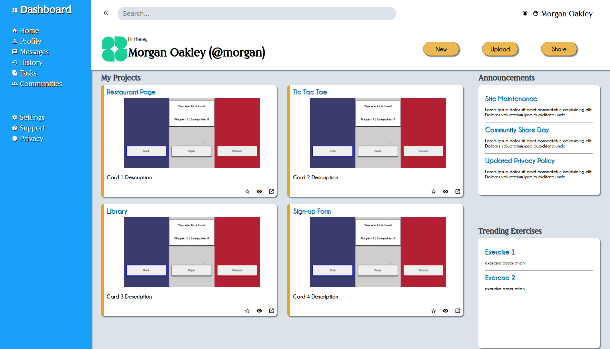

# Admin Dashboard

Dashboard page for projects. To be used as portfolio display once more projects are completed.

[Live Preview](https://bchung54.github.io/admin-dashboard/)

## Journey Through the TOP: My Web Dev Journey [(The Odin Project)](https://theodinproject.com/)

    <a href="https://github.com/bchung54/odin-recipes" target="_blank">Project #1: Recipes</a>
    |
    

    <a href="https://github.com/bchung54/landing-page" target="_blank">Project #2: Landing Page</a>
    |
    
    
    (flexbox)

    <a href="https://github.com/bchung54/rockpaperscissors" target="_blank">Project #3: Rock Paper Scissors</a>
    |
    
    
    

    <a href="https://github.com/bchung54/etch-a-sketch" target="_blank">Project #4: Etch-a-Sketch</a>
    |
    
    
    
    (events)

    <a href="https://github.com/bchung54/calc-project" target="_blank">Project #5: Calculator</a>
    |
    
    
    

    <a href="https://github.com/bchung54/sign-up-form" target="_blank">Project #6: Sign-up Form</a>
    |
    
    
    

    <a href="https://github.com/bchung54/admin-dashboard" target="_blank">Project #7: Admin Dashboard</a>
    |
    
    
    

    <a href="https://github.com/bchung54/library-project" target="_blank">Project #8: Library</a>
    |
    
    
    
    (objects)

    <a href="https://github.com/bchung54/tic-tac-toe" target="_blank">Project #9: Tic Tac Toe</a>
    |
    
    
    
    (factory functions, module pattern)

    <a href="https://github.com/bchung54/restaurant-page" target="_blank">Project #10: Restaurant Page</a>
    |
    
    
    
    
    (es6 modules)

    <a href="https://github.com/bchung54/todo-list" target="_blank">Project #11: To Do List</a>
    |
    
    
    
    

    <a href="https://github.com/bchung54/weather-app" target="_blank">Project #12: Weather App</a>
    |
    
    
    
    
    (apis, async)

    <a href="https://github.com/bchung54/battleship" target="_blank">Project #13: Battleship</a>
    |
    
    
    
    
    

    <a href="https://github.com/bchung54/portfolio" target="_blank">Project #14: Portfolio</a>
    |
    
    
    
    (animation, accessibility, responsive design)

    <a href="https://github.com/bchung54/cv-project" target="_blank">Project #15: CV Application</a>
    |
    
    
    
    

    <a href="https://github.com/bchung54/memory-cards" target="_blank">Project #16: Memory Cards</a>
    |
    
    
    
    

    <a href="https://github.com/bchung54/shopping-cart" target="_blank">Project #17: Shopping Cart</a>
    |
    
    
    
    

    <a href="https://github.com/bchung54/inventory-app" target="_blank">Project #18: Shoe Inventory</a>
    |
    
    
    
    
    
    

    <a href="https://github.com/bchung54/members-only" target="_blank">Project #19: Members Only</a>
    |
    
    
    
    
    
    
    (authentication)

    <a href="https://github.com/bchung54/blog-api" target="_blank">Project #20: Blog API</a>
    |
    
    
    
    
    
    

    <a href="https://github.com/bchung54/photo-tag" target="_blank">Full Stack Project: Photo Tag</a>
    |
    
    
    
    
    

    <a href="https://github.com/bchung54/odin-meta-api" target="_blank">Capstone Project: Odinbook</a>
    |
    
    
    
    
    
    
    

    <a href="https://github.com/bchung54/reddit-clone" target="_blank">Capstone Project: Reddit Clone</a>
    |
    
    
    
    
    
    
    
    

